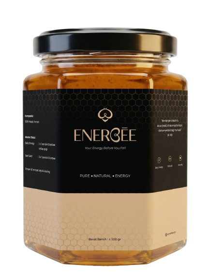

<div align="center">



# 🍯 ENERBEE — Premium Honey Landing Page

**Landing page modern, elegan, dan berorientasi konversi (high-converting)**
untuk produk **ENERBEE – Madu Yaman 100% Murni**.

[](#)
[](#)
[](#)
[-C19A3A?style=flat-square)](#)
[](#)

</div>

---

## 📋 Daftar Isi

- [Fitur Utama](#-fitur-utama)
- [Teknologi yang Digunakan](#️-teknologi-yang-digunakan)
- [Struktur File](#-struktur-file)
- [Cara Menjalankan](#-cara-menjalankan-usage)
- [Kustomisasi Cepat](#️-kustomisasi-cepat)
- [Responsivitas](#-responsivitas)

---

## ✨ Fitur Utama

**Desain & Konten**
- 🎨 **Desain Premium** — skema warna eksklusif (Ivory, Cream, Gold, Charcoal) & tipografi elegan (*Playfair Display* + *Poppins*)
- 🛡️ **Trust Strip** — garansi uang kembali, jangkauan pengiriman, metode bayar, dan respons CS ditampilkan sebagai penegas kepercayaan sebelum harga
- 🛒 **Cara Pemesanan** — panduan 3 langkah (pilih paket → konfirmasi WhatsApp → bayar & terima) agar calon pembeli tidak ragu
- ❓ **FAQ Accordion** — menjawab keberatan umum pembeli (keaslian produk, pengiriman, keamanan, pembayaran, garansi)
- ⭐ **Testimoni Marquee** — grid testimoni pelanggan berjalan otomatis (dua arah, dijeda saat di-hover)

**Psikologi Marketing (FOMO)**
- ⏱️ **Top Bar Countdown** — timer promo yang reset otomatis tiap tengah malam
- 📉 **Live Stock Bar** — indikator sisa slot promo yang berkurang otomatis untuk urgensi
- 🔔 **Social Proof Toast** — notifikasi pembeli (fiktif) muncul berkala di pojok layar

**Pengalaman Pengguna**
- 📱 **Fully Responsive** — teruji rapi di Desktop, Tablet (iPad 768px), hingga ponsel terkecil (320px), tanpa scroll horizontal
- 🍔 **Mobile Nav Menu** — navigasi hamburger dengan panel dropdown, otomatis tertutup saat memilih menu
- 📌 **Sticky Mobile Order Bar** — bar pemesanan mengambang di ponsel, muncul setelah melewati hero section
- 🧭 **Header Height Dinamis** — tinggi top bar & navbar diukur otomatis lewat JavaScript (bukan angka piksel tebakan), sehingga layout tidak pernah "geser" saat teks top bar melipat ke 2 baris di layar sempit
- ✨ **AOS (Animate On Scroll)** — elemen muncul dengan transisi *fade-up* halus saat discroll
- 🧊 **Animasi 3D Hover** — botol pada paket 2 & 3 menyebar saat card harga di-hover

**Konversi & SEO**
- 💬 **Direct Order to WhatsApp** — tombol pemesanan langsung terhubung ke WhatsApp CS dengan template pesan otomatis
- 🔍 **SEO Optimized** — Meta Tags lengkap, Open Graph untuk sosial media, dan struktur HTML semantik (`<main>`, `<section>`, `<nav>`)

---

## 🛠️ Teknologi yang Digunakan

| Teknologi | Kegunaan |
|---|---|
| **HTML5** | Struktur semantik & SEO friendly |
| **CSS3** | Flexbox, Grid, CSS Variables, Keyframes Animation, `clamp()` untuk skala responsif |
| **Vanilla JavaScript** | DOM Manipulation, IntersectionObserver, Timers, tanpa dependency eksternal |

Tidak ada framework, build step, Node.js, maupun NPM — murni HTML/CSS/JS sehingga sangat ringan dan cepat dimuat.

---

## 📁 Struktur File

```text
📂 LP_Madu_Enerbee
 ├── 📄 index.html      # Struktur utama halaman, semua section, & Meta SEO
 ├── 📄 style.css        # Seluruh gaya (styling), breakpoint responsif & animasi CSS
 ├── 📄 script.js        # Logika interaktif (Countdown, Stok, Popup, FAQ, Nav, Modal)
 ├── 🖼️ product-1.png    # Gambar transparan botol madu utama
 ├── 🖼️ product-1.jpg    # Gambar botol madu (varian foto)
 ├── 🖼️ product-2.jpg    # Gambar ilustrasi / lifestyle (section manfaat)
 └── 📄 README.md        # Dokumentasi proyek (file ini)
```

---

## 🚀 Cara Menjalankan (Usage)

Proyek ini tidak memerlukan instalasi tambahan (Node.js/NPM dsb).

1. *Clone* atau unduh repository ini:
   ```bash
   git clone https://github.com/renaldihairil/LP_Madu_Enerbee.git
   ```
2. Buka folder proyek.
3. Klik ganda pada `index.html` untuk membukanya di browser, atau gunakan ekstensi **Live Server** di VS Code untuk pengalaman simulasi lokal terbaik.

---

## ⚙️ Kustomisasi Cepat

| Yang ingin diubah | Buka file | Keterangan |
|---|---|---|
| Nomor WhatsApp & pesan CS | `script.js` | Fungsi `handleOrder()` — ganti `6281234567890` dengan nomor WA CS Anda |
| Nomor WA / Email / Instagram di footer | `index.html` | Cari komentar `<!-- TODO -->` di bagian `<footer>` |
| Data testimoni "Social Proof" (popup) | `script.js` | Variabel `orders` di dalam `initSocialProof()` |
| Harga & nama paket | `index.html` | Bagian `<section class="pricing">` |
| Pertanyaan FAQ | `index.html` | Bagian `<section class="faq">` |
| Warna tema | `style.css` | Ubah nilai HEX pada `:root` (contoh: `--gold: #C19A3A;`) |

---

## 📱 Responsivitas

Layout diuji pada breakpoint berikut dan dipastikan tidak ada elemen yang tumpang tindih atau scroll horizontal:

| Breakpoint | Perangkat | Perilaku |
|---|---|---|
| `> 1080px` | Desktop | Grid penuh (Hero 2 kolom, Why 4 kolom, Pricing 3 kolom) |
| `≤ 1080px` | Laptop kecil | Gap & ukuran font sedikit dikompres |
| `≤ 900px` | Tablet (mis. iPad 768px) | Hero/Benefits jadi 1 kolom, navbar berubah jadi menu hamburger |
| `≤ 600px` | Ponsel | Section lebih ringkas, sticky order bar muncul di bawah layar |
| `≤ 420px` | Ponsel kecil (mis. 320px) | Tombol & tipografi menyesuaikan agar tidak terpotong |

> Tinggi top bar & navbar diukur otomatis lewat JavaScript (CSS var `--topbar-h` / `--navbar-h`), jadi jika Anda mengubah isi top bar/navbar, seluruh layout di bawahnya akan otomatis menyesuaikan tanpa perlu mengedit angka padding secara manual.

---

<div align="center">

Dibuat dengan ❤️ untuk meningkatkan konversi penjualan produk herbal/madu Anda!

</div>
